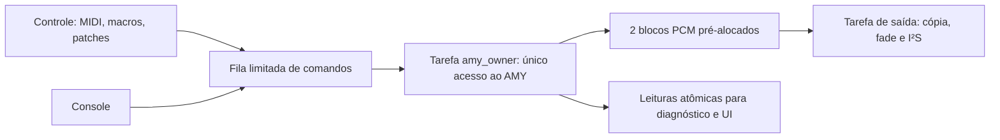

# AMY com proprietário único — ESP32-S3

Implementado em 2026-09-05, após a etapa descrita em
[stability_fixes.md](stability_fixes.md). Escopo: eliminar chamadas concorrentes
ao motor e separar operações de configuração da entrega de PCM ao I²S.

Atualização posterior: [firmware gravado e verificação inicial na placa](upload_smoke_20260905.md).
Os estados de validação abaixo registram a entrega anterior ao upload.

## Arquitetura



`AmyAdapter` conserva a API usada pelo restante da aplicação. Métodos de notas,
parâmetros, presets, modo mono e mensagens wire passam a copiar comandos para
uma fila. Ganho e a opção preexistente de limiter continuam como valores
atômicos; não acessam estruturas internas do AMY.

O motor é inicializado antes das tarefas. `startWorker()` transfere seu uso à
tarefa de síntese, no core 1, com prioridade `configMAX_PRIORITIES - 2`. Ela
processa até 16 comandos por bloco, executa a síntese e publica PCM. A tarefa
de saída permanece no core 1, com prioridade superior. Seu `render()` apenas
consome PCM: não chama AMY, não carrega patches e não aguarda o produtor.

O término da saída sinaliza parada ao produtor sem esperar por ele. A
destruição do adapter espera a saída do produtor antes de liberar AMY; só pode
ocorrer depois de encerrar o consumidor PCM. A aplicação respeita essa ordem
nos caminhos de falha da inicialização. Reinício das tarefas no mesmo adapter
não é suportado nesta etapa.

Essa divisão adapta a proposta inicial de tarefas do AGENTS.md e de núcleos
da seção 9 de specs.md. Preparação, alocação e parsing de patches pertencem à
fase de comandos do proprietário, fora da tarefa crítica de entrega I²S.
Não há modificação de arquivos do núcleo AMY nem do projeto paralelo P4.

## Filas, segurança e observação

- 64 comandos pré-alocados, com reserva de oito para liberações. A ordem é
  FIFO, inclusive Note On/Off. Comandos incluem timestamp e geração.
- Panic possui registro independente da capacidade. Uma liberação que não
  cabe aciona esse registro e sinaliza recuperação à tarefa de controle, que
  solicita Panic pelo EventBus para limpar também arpejador e sequenciador.
  Comandos musicais e mensagens wire anteriores
  são descartados; configurações tipadas pendentes preservam sua ordem.
- Novos comandos podem ser enfileirados depois da solicitação de Panic;
  o proprietário aplica o reset antes deles. O EventBus da aplicação mantém
  sua própria proteção de geração, independente dessa segunda fila.
- A geração também acompanha PCM. Uma solicitação de Panic invalida blocos
  anteriores, inclusive um bloco ainda sendo calculado pelo produtor.
  Um bloco já entregue ao driver/DMA não pode ser retirado por essa fila.
- Panic usa `amy_deltas_reset()` no contexto exclusivo do proprietário antes
  de liberar vozes/pedal. Isso cancela eventos internos futuros já expandidos
  em deltas. A regressão usa a API C; o antigo `t` wire não é suportado pelo
  parser desta versão do AMY.
- Mensagens de console são copiadas integralmente, até 255 bytes mais NUL.
  Mensagens maiores são rejeitadas e contadas, sem truncamento parcial.
- Se não houver PCM válido, a saída fornece um bloco de silêncio e conta a
  ocorrência. Não é uma garantia de continuidade audível: lacunas podem ser
  ouvidas. Falha de renderização sinalizada por buffer nulo encerra a saída
  pelo tratamento de falha existente.
- Leituras de scope, modo mono e carga do AMY não leem estruturas mutáveis
  do motor. O scope usa amostras atômicas; pode combinar dois frames visuais
  consecutivos, mas não tem acesso concorrente não sincronizado às amostras.

`audio_status` acrescenta:

| Campo | Significado |
| --- | --- |
| PCM gaps | Blocos de silêncio por ausência de PCM válido, incluindo descarte por Panic e partida. |
| command drops | Comandos rejeitados por capacidade/tamanho ou invalidados por Panic. |
| queue high-water | Maior ocupação observada da fila de comandos. |
| panics applied | Resets aplicados pela fase de comandos do proprietário. |
| max command wait | Maior espera entre submissão ao adapter e início da aplicação, em microssegundos; não é latência tecla–áudio. |

`Max Render Us` e `Avg Render Us` incluem a fase de comandos, síntese e cópia
para PCM; não medem apenas a cópia feita pela tarefa I²S. `Frames Rendered`
conta produção do motor, sem duplicar os frames consumidos. O contador de
erros I²S anterior permanece separado de `PCM gaps`.

## Custo e limites

| Medida de build | Antes | Depois |
| --- | ---: | ---: |
| Flash reportada pelo PlatformIO | 915.539 bytes | 919.515 bytes |
| RAM estática reportada | 28.860 bytes | 28.876 bytes |

A RAM estática não inclui o novo armazenamento dinâmico: aproximadamente
20 KiB em RAM interna para fila, PCM e metadados, mais uma pilha de 16 KiB
e recursos FreeRTOS. São alocados na inicialização. Não há medição de heap
livre/fragmentação ou margem da pilha na placa nesta entrega.

Os dois blocos de 256 frames a 48 kHz comportam 10,67 ms de áudio adicional,
além do DMA existente de quatro blocos. O tempo entre submissão e som depende
também da ocupação das filas, carga, USB e AMY. Essa capacidade não equivale a
uma medição de latência. Há duas cópias explícitas de 1 KiB por bloco para
separar a memória mutável de render, fila PCM e fade da saída.

Configurações pesadas continuam podendo ultrapassar o prazo de 5,33 ms por
bloco. A fila limita quantidade de comandos, não o tempo de execução de uma
operação AMY arbitrária. A preparação completa de patches fora do motor,
com troca sem lacunas, exige outra etapa. Acesso à Flash em outros componentes
também pode afetar prazos; esta mudança não certifica todos os modos do AMY
como livres de alocação ou bloqueio durante síntese.

O console wire continua uma interface de diagnóstico com comandos amplos.
Não foi transformado em sandbox: redefinição de osciladores, mapas ou recursos
por comandos arbitrários pode contrariar o modelo de instrumentos do produto.
Panic de notas mantidas em osciladores brutos fora dos instrumentos e resets
arbitrários de todo o AMY ainda exigem delimitar esse modo de diagnóstico.

Estado de PatchManager, sequenciador e UI ainda pode ser acessado pelo controle
e console em paralelo; a exclusividade estabelecida aqui cobre o AMY. Uma
seleção de patch ainda indica a intenção da aplicação, sem confirmação de
conclusão do proprietário. Saturação pode descartar configurações; conferir
`command drops`. Transações de patch, confirmações de aplicação e persistência
permanecem pendentes.

## Validação

Comandos executados a partir da raiz, PowerShell, GCC/G++ no PATH:

```powershell
./tests/run_smk_amy_boot.ps1
./tests/run_smk_safety.ps1
C:/.platformio/penv/Scripts/pio.exe run -d smk-s3 -e esp32-s3-devkitc-1
```

| Status | Evidência |
| --- | --- |
| PASS | AMY real: alocação, 256 patches, notas, CC, bateria e Panic. |
| PASS | Novo teste de proprietário: wrappers da linkedição rejeitam chamadas AMY fora do contexto autorizado; produtores concorrentes e consumidor PCM usam a implementação real das filas. |
| PASS | Limite de comandos por bloco, FIFO, reserva de liberações, cópia de wire, rejeição de mensagem excessiva, saturação, PCM cheio/vazio e falha de criação da tarefa. |
| PASS | Panic durante renderização deliberadamente suspensa: consumidor continua e descarta o resultado antigo; encerramento do produtor testado. |
| PASS | Evento futuro pela API C não reaparece após Panic; retirar `amy_deltas_reset()` numa cópia em build reproduziu a falha esperada. |
| PASS | Regressões MIDI/áudio, preservação das métricas do produtor e notificação de parada em erro I²S. |
| PASS | Teste de UI existente recompilado e executado (`build/test_smk_ui.exe`). |
| PASS | Build ESP32-S3 com plataforma instalada 55.3.35 e ESP-IDF 5.5.1; revisão de whitespace do diff. |
| NOT RUN | Upload e builds de outras plataformas. |
| MANUAL | Prazos, continuidade analógica, memória e comportamento sob carga no S3. |

O primeiro build reutilizou a lista de fontes em cache e falhou na linkedição.
Na plataforma instalada, o detector de reconfiguração acompanha os CMakeLists
da raiz e main, mas não o do componente. A regeneração foi acionada sem mudar
o conteúdo de arquivos, antes do build que passou:

```powershell
(Get-Item -LiteralPath 'smk-s3/CMakeLists.txt').LastWriteTime = Get-Date
```

Os avisos de conversão de ponteiros em código de diagnóstico AMY no build
Windows são preexistentes. Os testes usam threads reais de host e um mock de
agendamento FreeRTOS, não validam prioridades nem prazos do ESP32.

## Próxima verificação na placa

1. Confirmar a mesma revisão N16R8, GPIOs, VBUS e PCM5102A usados na etapa
   anterior. Nenhuma pinagem ou configuração de display foi alterada aqui.
2. Executar `memory`, `status` e `audio_status` após a partida. Registrar heap
   interno/PSRAM, ocupação máxima da fila e valores iniciais de PCM gaps.
3. Tocar acordes e movimentar controles por dez minutos sem trocar patches;
   esperar que PCM gaps e erros I²S não cresçam depois da estabilização.
4. Repetir com efeitos, display e trocas de patch. Registrar cada aumento de
   PCM gaps, máximo de render e espera dos comandos. Capturar a saída e medir
   a latência antes de aceitar o custo dos dois blocos adicionais.
5. Acionar `panic` e desconectar USB com notas/arp ativos. Verificar que não
   reaparecem notas antigas e que novas notas funcionam após reconectar.
6. Se houver falta de memória, criação de tarefa deve falhar explicitamente;
   não reduzir pilhas ou alterar PSRAM sem medir a margem correspondente.

Próximo passo mínimo: executar essa bancada; depois adicionar confirmação e
aplicação transacional de patches para a UI refletir o estado efetivo do motor.
